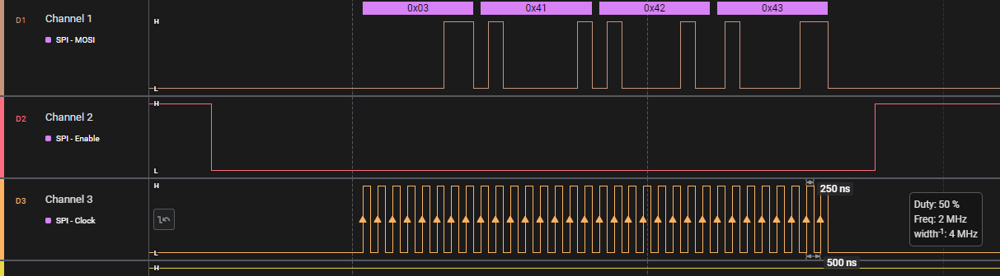
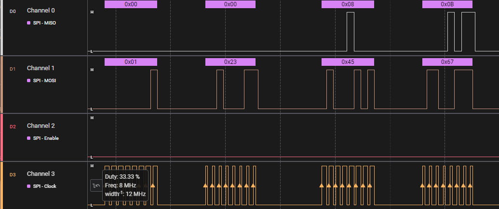
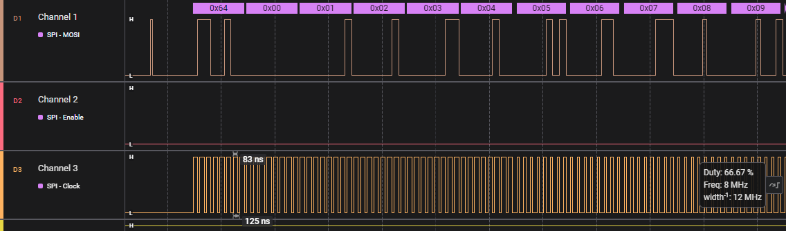

# IOCTL statement description  
  
## Description    
  
`IOCTL` statement allows performing some low level operations and sending commands to MCU peripherals.  
  
**Syntax:**  
`IOCTL <device_name>, <command_name>[, <command_data>]`  
`<device_name>` is a name of MCU's peripheral device to send command to. A special device name `CPU` is used to manage MCU core settings and run some low-level commands.  
  
## Available devices and commands  
  
### CPU  
  
- `IOCTL CPU, INTERRUPTS, ON | OFF` - enable or disable interrupts, by default interrups are disabled.  
- `IOCTL CPU, CLOCKSOURCE, HSI | HSI16 | LSI | HSE16 | HSE8` - select MCU clock source generator, default is `HSI`. `HSI` stands for the maximum possible frequence available with internal RC oscillator, `HSI16` - 16 MHz with internal oscillator, `HSE8` - 8 MHz with 8 MHz external crystal oscillator, `HSE16` - 16 MHz with 16 MHz external crystal oscillator.  
- `IOCTL CPU, WAIT, INTERRUPT` - wait for interrupt command  
- `IOCTL CPU, DELAYMS, <numeric_value>` - pauses program execution for the specified amount of time (in milliseconds, acceptable range of the numeric argument is: 0 to 255 ms). The command is based on loops and cannot be used for precise delays generation (it should delay for not less than the specified amount of time).  
  
### GPIO  
  
- `IOCTL PX, CFGPINY, IN_FLOAT_NOEXTI | IN_FLOAT_EXTI | IN_PULLUP_NOEXTI | IN_PULLUP_EXTI | OUT_OPENDRAIN_SLOW | OUT_OPENDRAIN_FAST | OUT_PUSHPULL_SLOW | OUT_PUSHPULL_FAST` - configure single GPIO port pin.  
- `IOCTL PX, SETPINY` - set single pin (set to high logic level)  
- `IOCTL PX, CLRPINY` - clear single pin (set to low logic level)  
- `IOCTL PX, INVPINY` - invert pin state  
- `IOCTL PX, ENABLE` - enable GPIO port  
- `IOCTL PX, DISABLE` - disable GPIO port  
  
Here `PX` stands for GPIO port name (e.g. `PA` for port A) and command names should specify the port pin (pin number should be the last character of the command, instead of Y character in the patterns above).  
  
**Example:**  
`REM configure pin 5 of port B as output push-pull and write 0 to the pin`  
`IOCTL PB, ENABLE`  
`IOCTL PB, CFGPIN5, OUT_PUSHPULL_FAST`  
`IOCTL PB, CLRPIN5`  
  
### UART  
  
- `IOCTL UART, INPUTECHO, ON | OFF` - enable or disable input echo (enabled by default)  
- `IOCTL UART, TRANSMODE, DUPLEX | SIMPLEX` - transmission mode (default is `DUPLEX`)  
- `IOCTL UART, CFGPINS, ON | OFF` - configure GPIO pins before starting communication (enabled by default)  
- `IOCTL UART, SPEED, 9600 | 14400 | 19200 | 38400 | 57600 | 115200` - set UART baud rate (default is `9600`)  
- `IOCTL UART, NEWLINE, <string_value>` - set new-line sequence (default is CRLF)  
- `IOCTL UART, MARGIN, <numeric_value>` - set margin (print area width, default is 80 characters)  
- `IOCTL UART, ZONEWIDTH, <numeric_value>` - set print zone width (default is 10 characters)  
- `IOCTL UART, START [, RX | TX]` - select data transmission direction and start communication (transmission direction is valid for simplex mode only, default is `TX`)  
- `IOCTL UART, STOP` - stop communication  
- `IOCTL UART, ENABLE` - enable UART  
- `IOCTL UART, DISABLE` - disable UART  
  
**Example:**  
`REM the simplest UART configuration, duplex mode 8N1 9600 baud`  
`IOCTL UART, ENABLE`  
`IOCTL UART, START`  
  
`IOCTL UART, CFGPINS` command can be used to configure GPIO pins involved in UART communication. After disabling UART the pins are not deinitialized to their initial state (e.g.: UART TX pin stays configured as output push-pull).  
  
### TIMER  
  
- `IOCTL TIMER, PRESCALER, DIV1 | DIV2 | DIV4 | DIV8 | DIV16 | DIV32 | DIV64 | DIV128 | DIV256 | DIV512 | DIV1024 | DIV2048 | DIV4096 | DIV8192 | DIV16384 | DIV32768` - set timer clock prescaler (frequency divisor)  
- `IOCTL TIMER, VALUE, <numeric_value>` - set timer counter  
- `IOCTL TIMER, PERIODMS, <numeric_value>` - set timer period in ms (tries setting prescaler and value automatically)  
- `IOCTL TIMER, INTERRUPT, ON | OFF` - enable or disable timer update interrupt (disabled by default)  
- `IOCTL TIMER, CLRINTFLAG` - clear update interrupt flag  
- `IOCTL TIMER, ONUPDOVF, <line_number>` - use BASIC subroutine starting from the specifide line number as a handler for timer's update/overflow interrupt, the handler automatically clears update interrupt flag (see previous command description)  
- `IOCTL TIMER, START` - start timer  
- `IOCTL TIMER, STOP` - stop timer  
- `IOCTL TIMER, ENABLE` - enable timer  
- `IOCTL TIMER, DISABLE` - disable timer  
  
**Example:**  
`IOCTL CPU, INTERRUPTS, ON`  
`IOCTL TIMER, ENABLE`  
`IOCTL TIMER, PERIODMS, 100`  
`IOCTL TIMER, ONUPDOVF, 1000`  
`IOCTL TIMER, INTERRUPT, ENABLE`  
`IOCTL TIMER, START`  
`...`  
`END`  
  
`1000 REM timer's update interrupt handler`  
`...`  
`RET`  
  
### SPI  
  
- `IOCTL SPI, MODE, M0 | M1 | M2 | M3` - specify clock polarity (CPOL) and clock phase (CPHA) or so-called SPI mode: M0 (CPOL = 0, CPHA = 0), M1 (CPOL = 0, CPHA = 1), M2 (CPOL = 1, CPHA = 0), M3 (CPOL = 1, CPHA = 1), default is `M0`  
- `IOCTL SPI, MASTER, ON | OFF` - set master or slave mode (default mode is master)  
- `IOCTL SPI, PRESCALER, DIV2 | DIV4 | DIV8 | DIV16 | DIV32 | DIV64 | DIV128 | DIV256` - set SPI clock prescaler (frequency divisor, default is `DIV2`)  
- `IOCTL SPI, FRAMEFMT, MSBFIRST | LSBFIRST` - data frame format (LSB-first or MSB-first, default is `MSBFIRST`)  
- `IOCTL SPI, TRANSMODE, DUPLEX | HALFDUPLEX | SIMPLEX` - SPI transmission mode (default is `DUPLEX`)  
- `IOCTL SPI, SSPIN, <pin_name> | NONE` - specify slave select pin, `<pin_name>` format is `<port_name><pin_number>`, e.g.: `PA3`, `PE5`, etc. A special keyword `NONE` specified instead of the pin name disables automatic SS pin management. Default value corresponds to default NSS pin of the selected MCU.  
- `IOCTL SPI, CFGPINS, ON | OFF` - configure GPIO pins when starting communication (enabled by default)  
- `IOCTL SPI, WAIT, RXNE | TXE | NOTBSY` - wait for the specified event: `RXNE` stands for "RX buffer is not empty" (a byte is read into external MCU buffer and can be extracted with `GET` statement), `TXE` - "TX buffer is empty" (the next byte can be written with `PUT` statement), `NOTBSY` - "SPI transmission is complete" (all data is transferred, SPI device can be released).  
- `IOCTL SPI, START [, TX | RX]` - selects data transmission direction, enables slave device (in master mode only, if SS pin management is not turned off with `IOCTL SPI, SSPIN, NONE`), starts SPI communication. Transmission direction is valid for simplex and half-duplex modes only, default is `TX`.  
- `IOCTL SPI, STOP` - stop SPI communication  
- `IOCTL SPI, ENABLE` - enable SPI  
- `IOCTL SPI, DISABLE` - disable SPI  
  
**Example:**  
`IOCTL SPI, ENABLE`  
`IOCTL SPI, MODE, M0`  
`IOCTL SPI, MASTER`  
`IOCTL SPI, PRESCALER, DIV8`  
`IOCTL SPI, FRAMEFMT, MSBFIRST`  
`IOCTL SPI, TRANSMODE, SIMPLEX`  
`IOCTL SPI, SSPIN, PA3`  
`IOCTL SPI, CFGPINS`  
`IOCTL SPI, START, TX`  
`PUT #SPI, 5, "hello"`  
`IOCTL SPI, STOP`  
`IOCTL SPI, DISABLE`  
  
Master simplex RX-only and master half-duplex RX modes are not fully implemented at the moment because of their odd disabling procedure. `IOCTL SPI, CFGPINS` command can be used to configure GPIO pins involved in SPI communication but disabling SPI with `IOCTL SPI, DISABLE` does not deinitializes them to their initial state (e.g.: master's CLK pin stays configured as output push-pull).  
  
  
SPI simplex transmission example (2 MHz, 3 characters long string)  
  
  
SPI duplex transmission example (8 MHz, 4-byte integer values)  
  
  
SPI continuous transmission example (8 MHz, 100 bytes long array)  
  
### ST7565_SPI  
  
`ST7565_SPI` commands can be used to setup a driver for monochrome LCD displays based on ST7565 chip (with resolution up to 132x64). The driver chip must be configured to communicate via `SPI` interface (serial interface mode).  
  
- `IOCTL ST7565_SPI, RSTPIN, <pin_name> | NONE` - specify MCU pin connected to display driver reset pin, `<pin_name>` format is `<port_name><pin_number>`, e.g.: `PF4`. A special keyword `NONE` specified instead disables automatic hardware reset of the driver chip (default behavior).  
- `IOCTL ST7565_SPI, DCPIN, <pin_name>` - specify MCU pin connected to display driver data/command mode selection pin (the command is mandatory).  
- `IOCTL ST7565_SPI, CFGPINS, ON | OFF` - configure GPIO pins automatically (enabled by default). The command affects the next pins: SPI MOSI pin, SPI NSS pin (if not disabled), SPI CLK pin, RST pin (if not disabled) and DC pin.  
- `IOCTL ST7565_SPI, INIT, <disp_cfg_name> | <var_name>` - select display model (`<disp_cfg_name>` - name of one of the predefined models, `<var_name>` - name of byte array variable that contains display initializaton data).  
- `IOCTL ST7565_SPI, FONT, <font_name>` -  select font (`8x8` and `8x16` dot matrix fonts are supported).  
- `IOCTL ST7565_SPI, ZONEWIDTH, <numeric_value>` - set print zone width (default is 8 characters)  
- `IOCTL ST7565_SPI, START` - initializes SPI, resets LCD driver chip, applies display initialization parameters (set with `INIT` command), etc. After the command execution display is ready to operate.  
- `IOCTL ST7565_SPI, STOP` - completes current SPI transmission, releases slave SPI device (display driver chip).  
- `IOCTL ST7565_SPI, ENABLE` - enables SPI bus.  
- `IOCTL ST7565_SPI, DISABLE` - disables SPI bus.  
- `IOCTL ST7565_SPI, CONTRAST, <numeric_value>` - set display contrast, acceptable value range is \[1..100\]. The command can be used after `ENABLE` command (when display driver is ready to accept commands).  
  
Fonts included with the compiler:  
`FONT_IBM_8X8_CP437_7BIT_ST7565` - 8x8 ASCII font (128 characters), CP437 code page  
`FONT_IBM_8X8_CP437_FULL_ST7565` - 8x8 extended ASCII font (256 characters), CP437 code page  
`FONT_IBM_8X16_CP437_7BIT_ST7565` - 8x16 ASCII font (128 characters), CP437 code page  
`FONT_IBM_8X16_CP437_FULL_ST7565` - 8x16 extended ASCII font (256 characters), CP437 code page  
  
The library was tested with two Chinese displays marked "GM12864-01A" and "GMG12864-06D Ver:2.0", predefined configuration names for them are `DISP_GM12864_01A` and `DISP_GMG12864_06D_V2`.  
  
**Example:**  
`IOCTL ST7565_SPI, ENABLE`  
`IOCTL ST7565_SPI, RSTPIN, PF4`  
`IOCTL ST7565_SPI, DCPIN, PB3`  
`IOCTL ST7565_SPI, CFGPINS`  
`IOCTL ST7565_SPI, INIT, DISP_GM12864_01A`  
`IOCTL ST7565_SPI, FONT, FONT_IBM_8X16_CP437_7BIT_ST7565`  
`IOCTL ST7565_SPI, START`  
`PRINT #ST7565_SPI, "Hello world!"`  
  
  